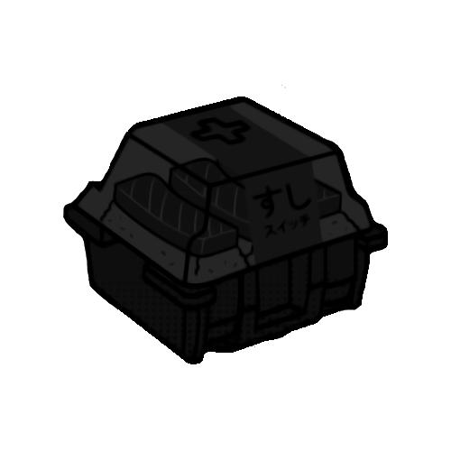
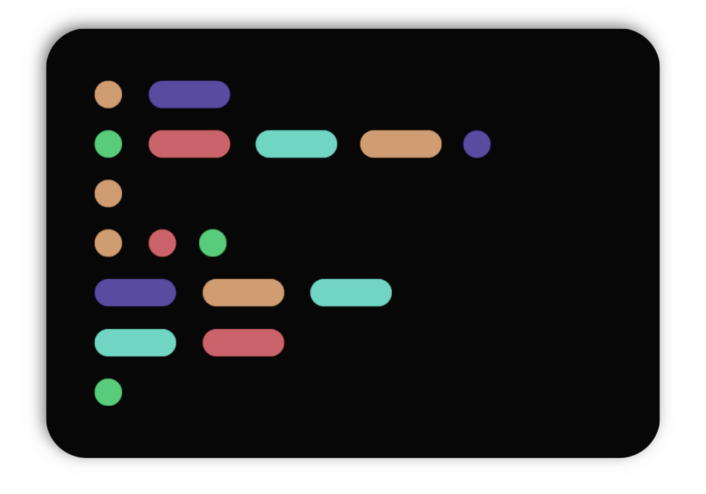
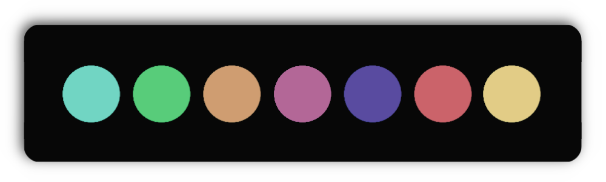

<div align="center">
  
</div>

<br>


<h1 align="center"><b>🎨 Palette</b></h1>

<br>

<br>



<div>

   <b>#71D5C3</b>
  
   <b>#71D5C3</b>
  
   <b>#71D5C3</b>
  
   <b>#71D5C3</b>
  
   <b>#71D5C3</b>
  
   <b>#71D5C3</b>
  
   <b>#71D5C3</b>
</div>

<br>


<div align="center">
  <h2 align="center"><b>🧑‍💻 Codes</b></h2>
</div>

<div align="center">
  
</div>

<details align="center">
<summary align="center">HEX / RGB - CODE</summary>
<div align="center">

  ``` black        = #070707 | rgb = (7,7,7) 
  gray_scale_1 = #101010 | rgb = (16,16,16)
  gray_scale_2 = #191919 | rgb = (25,25,25) 
  gray_scale_3 = #313131 | rgb = (49,49,49) 

  text       = #A5A5A5 | rgb = (165,165,165) 
  text_var   = #777777 | rgb = (119,119,119) 
  unselected = #2E2E2E | rgb = (46,46,46) 

  red    = #CB636A | rgb = (203,99,106) 
  green  = #58CC7A | rgb = (88,204,122) 
  orange = #CF9D71 | rgb = (207,157,113) 
  cyan   = #71D5C3 | rgb = (113,213,195) 
  purple = #594BA0 | rgb = (89,75,160) 
  pink   = #B36797 | rgb = (179,103,151) 
  yellow = #E2CC86 | rgb = (226,204,134)
  ```

</div>
</details>
